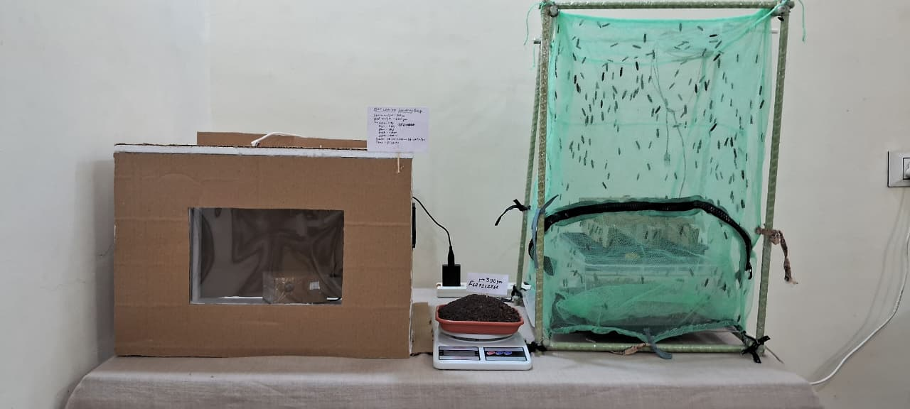
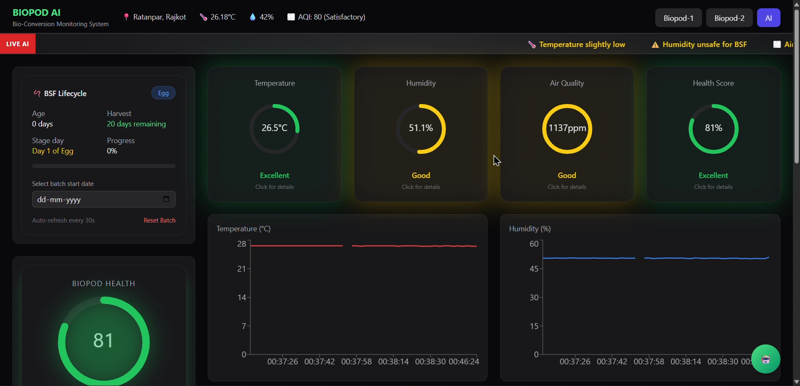

<div align="center">


<br/>

[](https://nodejs.org)
[](https://reactjs.org)
[](https://mongodb.com)
[](https://espressif.com)
[](https://mqtt.org)
[](https://tailwindcss.com)
[](https://expressjs.com)

<br/>

> ### *"Let nature convert. Let engineering control."*

<br/>

| 🏆 Achievement | 📊 Scale | ⏱️ Duration | 👥 Team |
|:---:|:---:|:---:|:---:|
| **Top 30 National Winners** | **850+ Teams** | **5 Months** | **Team Lead** |
| VOIS Innovation Marathon 2.0 | National Level | Full Program | Pratyush Prakash |

<br/>

[](https://github.com/PRATYUSH2444)
[](https://github.com/PRATYUSH2444)
[](https://github.com/PRATYUSH2444)

</div>

---

## 📸 Project Gallery

<div align="center">

| | |
|:---:|:---:|
|  |  |
| **🔧 BioPod Hardware Unit** — ESP32 + DHT22 + MQ135 assembled | **📊 Live Dashboard** — Real-time metrics and health score |

> 📌 *Replace placeholders with actual project photos — hardware setup, dashboard screenshots, sensor wiring, competition demo day*

</div>

---

## 🧬 What is Black Soldier Fly Farming?

<details>
<summary><b>Click to understand the biology behind BioPod</b></summary>

<br/>

**Black Soldier Fly (Hermetia illucens)** is one of nature's most efficient bioconversion organisms.

| Biological Fact | Value |
|---|---|
| 🥩 Larvae protein content | 40–44% dry weight |
| 🌿 Larvae fat content | 30–35% dry weight |
| ♻️ Waste reduction capability | 60–80% of organic input |
| ⏱️ Full lifecycle | 40–45 days (egg to adult fly) |
| 🌡️ Optimal temperature | 27°C – 32°C |
| 💧 Optimal humidity | 50% – 70% |
| 🌬️ Air quality sensitivity | High — ammonia kills larvae |
| 💡 Light requirement | Flies need 12–16 hrs light for mating |
| 🧫 Feed conversion ratio | 1.5 kg waste → 1 kg larvae |

**Why BSF matters:**
- Larvae convert organic waste 10x faster than composting
- Output: high-protein animal feed + bio-fertilizer (frass)
- Sustainable alternative to fish meal and soybean protein
- Naturally present in nature — no genetic modification
- Larvae are self-regulating — they pupate and leave the bin when done

**The biological challenge BioPod solves:**
BSF larvae are highly sensitive to environmental drift. A 5°C temperature spike, humidity drop below 50%, or ammonia buildup from waste can stress the colony — causing mass mortality and failed batches. Manual monitoring is unreliable at scale. BioPod provides continuous automated oversight.

</details>

---

## 🎯 The Problem

```
🗑️  Organic waste = 40–55% of all municipal solid waste

❌  Current situation:
    ├── Sent to landfill → methane emissions
    ├── BSF farming is unstable without monitoring
    ├── Farmers rely on manual checks (1–2x/day)
    ├── Environmental drift = entire batch death
    └── No affordable, real-time control system exists

✅  BioPod changes this:
    ├── Continuous 24/7 environmental monitoring
    ├── Real-time alerts before conditions become critical
    ├── AI health scoring — explains what's wrong and why
    └── Actuator control — fan, heater, humidifier respond automatically
```

---

## 🏗️ System Architecture

```
╔══════════════════════════════════════════════════════════════════╗
║                      HARDWARE LAYER                              ║
║                                                                  ║
║   ┌─────────────────────────┐    ┌─────────────────────────┐    ║
║   │    🟠 FEED BIOPOD UNIT  │    │    🟣 FLY CAGE UNIT     │    ║
║   │                         │    │                         │    ║
║   │  ESP32 ← Controller     │    │  ESP32 ← Controller     │    ║
║   │  DHT22 ← Temp/Humidity  │    │  DHT22 ← Temp/Humidity  │    ║
║   │  MQ135 ← Gas/AQ         │    │  LDR   ← Light cycle    │    ║
║   │  PTC   ← Heater         │    │  Humid ← Moisture ctrl  │    ║
║   │  Fan   ← Ventilation    │    │  LED   ← Breeding light │    ║
║   └────────────┬────────────┘    └────────────┬────────────┘    ║
╚════════════════╪════════════════════════════════╪════════════════╝
                 │ WiFi + MQTT (2–5 sec interval)  │
                 ▼                                  ▼
╔══════════════════════════════════════════════════════════════════╗
║                   COMMUNICATION LAYER                            ║
║              MQTT Broker · QoS Level 1 · JSON                    ║
║         Topic: biopod/{unit_type}/{device_id}/sensors            ║
╚══════════════════════════════╦═══════════════════════════════════╝
                               │
                               ▼
╔══════════════════════════════════════════════════════════════════╗
║                      BACKEND LAYER                               ║
║                                                                  ║
║   MQTT Client → JSON Parser → Health Engine → Alert Service      ║
║                                    ↓                             ║
║                              MongoDB Store                        ║
║                                    ↓                             ║
║                    REST APIs → React Frontend                     ║
╚══════════════════════════════════════════════════════════════════╝
                               │
                               ▼
╔══════════════════════════════════════════════════════════════════╗
║                      FRONTEND LAYER                              ║
║            React · Vite · Tailwind CSS · Chart.js                ║
║                                                                  ║
║    Live Metrics · Health Score · AI Insights · Alerts Panel      ║
╚══════════════════════════════════════════════════════════════════╝
```

---

## 🔄 Data Flow — Step by Step

```
Step 1  →  Sensor detects environment (temp, humidity, gas, light)
Step 2  →  ESP32 reads values every 2–5 seconds
Step 3  →  ESP32 formats into JSON payload
Step 4  →  Published to MQTT broker over WiFi (QoS 1)
Step 5  →  Node.js backend MQTT client receives message
Step 6  →  JSON parsed + values validated + clamped
Step 7  →  AI Health Engine runs rule-based scoring
Step 8  →  Data + health score stored in MongoDB
Step 9  →  REST API serves data to React dashboard (polling 5s)
Step 10 →  Dashboard renders live metrics, graphs, insights
Step 11 →  If threshold breach → alert generated
Step 12 →  Backend sends control signal → ESP32 actuator
            (fan turns ON / heater adjusts / humidifier activates)
```

---

## 🤖 AI Intelligence Engine

> **Philosophy:** *AI predicts and explains. Humans decide. Industry 5.0.*

```
┌─────────────────────────────────────────────────────────┐
│               HEALTH SCORE FORMULA                       │
│                                                         │
│  Score = (0.4 × Stability) + (0.3 × Gas Safety)        │
│        + (0.3 × Stress Inverse)                         │
│                                                         │
│  Output range: 0 – 100  (0 = Critical, 100 = Optimal)  │
└─────────────────────────────────────────────────────────┘
```

### 🧠 Module 1 — Environment Stability
```
Optimal temperature:  27°C – 30°C  ✅
Warning temperature:  24°C – 27°C  ⚠️  or  30°C – 33°C  ⚠️
Critical temperature: < 24°C       🔴  or  > 33°C        🔴

Optimal humidity:     50% – 65%    ✅
Warning humidity:     40% – 50%    ⚠️  or  65% – 75%     ⚠️
Critical humidity:    < 40%        🔴  or  > 75%          🔴

→ Output: Stability Score (0–100)
```

### 🧠 Module 2 — Gas Risk Intelligence
```
MQ135 reading:
< 800 ppm   →  SAFE      🟢  Air quality optimal
800–1200    →  WARNING   🟡  Increase ventilation
> 1200 ppm  →  DANGER    🔴  Emergency — fan ON, alert sent

→ Output: Risk Level
```

### 🧠 Module 3 — Stress Detection
```
Combines: temperature drift + humidity fluctuation + gas trend
Spike in any 2+ signals simultaneously = Stress Event detected

→ Output: Stress Index + human-readable explanation
```

### 🧠 Module 4 — Breeding Intelligence (Fly Cage)
```
Light cycle:   12–16 hours light = optimal mating conditions
Humidity:      55–65% = optimal egg-laying environment
LDR reading:   < threshold = insufficient light = poor breeding

→ Output: Breeding Score + cycle recommendation
```

---

## 🛠️ Tech Stack

| Layer | Technology | Version | Why Chosen |
|:---:|:---:|:---:|:---|
| 🔴 Microcontroller | ESP32 | — | Built-in WiFi, GPIO, low cost, field-ready |
| 🌡️ Sensor | DHT22 | — | Reliable ±0.5°C accuracy, temp + humidity combo |
| 🌬️ Sensor | MQ135 | — | Air quality, ammonia and CO₂ proxy detection |
| 💡 Sensor | LDR | — | Light cycle detection for fly cage breeding |
| 📡 Protocol | MQTT 3.1.1 | 3.1.1 | Lightweight, real-time, built for IoT |
| 🟢 Backend | Node.js | 18+ | Async, event-driven, fast for IoT data streams |
| ⚡ Framework | Express.js | 4.x | Clean REST API routing, minimal overhead |
| 🍃 Database | MongoDB | 6.x | Flexible schema, perfect for sensor time-series |
| ⚛️ Frontend | React + Vite | 18 | Fast, component-based, reactive UI |
| 🎨 Styling | Tailwind CSS | 3.x | Utility-first, responsive dashboard |
| 📈 Charts | Chart.js / Recharts | — | Real-time, animated data visualization |
| 🔗 HTTP Client | Axios | — | API communication frontend → backend |

---

## 📡 MQTT Payload Structure

**Topic Format:**
```
biopod/feedbox/BSF_FEED_001/sensors
biopod/flybox/BSF_FLY_001/sensors
biopod/{unit}/{id}/control
biopod/{unit}/{id}/alerts
```

**Sensor Payload:**
```json
{
  "device_id": "BSF_FEED_001",
  "unit_type": "feedbox",
  "temperature": 28.4,
  "humidity": 62.1,
  "gas": 820,
  "fan": "ON",
  "mode": "AUTO",
  "health_score": 78,
  "timestamp": "2026-04-22T10:30:00Z"
}
```

**Control Payload (Backend → ESP32):**
```json
{
  "device_id": "BSF_FEED_001",
  "command": "FAN_ON",
  "mode": "AUTO",
  "triggered_by": "gas_threshold_breach"
}
```

---

## 🗄️ Database Schema

```javascript
// SensorData — MongoDB Collection
{
  device_id:    { type: String,  required: true, index: true },
  unit_type:    { type: String,  enum: ['feedbox', 'flybox'] },
  temperature:  { type: Number,  min: -10,  max: 60  },
  humidity:     { type: Number,  min: 0,    max: 100 },
  gas:          { type: Number,  min: 0              },
  fan:          { type: String,  enum: ['ON', 'OFF'] },
  mode:         { type: String,  enum: ['AUTO', 'MANUAL'] },
  health_score: { type: Number,  min: 0,    max: 100 },
  status:       { type: String,  enum: ['OPTIMAL', 'WARNING', 'CRITICAL'] },
  alerts:       [{ type: String }],
  createdAt:    { type: Date,    default: Date.now, index: true }
}
```

---

## 🔌 API Endpoints

| Method | Endpoint | Description | Response |
|:---:|:---|:---|:---|
| `GET` | `/api/sensors/latest` | Latest sensor reading | JSON object |
| `GET` | `/api/sensors/history` | Historical data for graphs | Array of readings |
| `GET` | `/api/ai/health-history` | Health score over time | Score timeline |
| `GET` | `/api/ai/insights` | AI-generated insight messages | Insight array |
| `GET` | `/api/ai/bsf-status` | BSF lifecycle stage + score | Status object |
| `POST` | `/api/control/fan` | Toggle fan ON/OFF | Confirmation |
| `POST` | `/api/control/mode` | Switch AUTO/MANUAL | Updated mode |
| `GET` | `/api/alerts` | Recent alert history | Alert array |

---

## 📁 Project Structure

```
BioPod-Dashboard/
│
├── 📂 backend/
│   └── src/
│       ├── 🤖 ai/
│       │   ├── healthEngine.js       # Health score calculation
│       │   ├── gasRisk.js            # MQ135 risk assessment
│       │   ├── stressDetector.js     # Multi-signal stress analysis
│       │   └── breedingScore.js      # Fly cage breeding intelligence
│       ├── 🎮 controllers/
│       │   └── sensorController.js   # API request handlers
│       ├── 🗄️ models/
│       │   └── SensorData.js         # MongoDB schema
│       ├── 📡 mqtt/
│       │   ├── mqttClient.js         # Broker connection + subscription
│       │   └── messageHandler.js     # Incoming message processor
│       ├── 🛣️ routes/
│       │   ├── sensorRoutes.js       # Sensor data endpoints
│       │   ├── aiRoutes.js           # AI insight endpoints
│       │   └── controlRoutes.js      # Actuator control endpoints
│       ├── 🔧 services/
│       │   └── alertService.js       # Threshold breach alert logic
│       ├── ⚙️ utils/
│       │   └── thresholds.js         # All threshold constants
│       ├── app.js                    # Express setup + middleware
│       └── server.js                 # Entry point
│
├── 📂 frontend/
│   └── src/
│       ├── 🧩 components/
│       │   ├── Dashboard.jsx         # Main dashboard layout
│       │   ├── MetricCard.jsx        # KPI stat cards
│       │   ├── LiveChart.jsx         # Real-time graphs
│       │   ├── AlertPanel.jsx        # Alert feed
│       │   ├── HealthGauge.jsx       # Health score dial
│       │   └── InsightCard.jsx       # AI insight display
│       ├── 📄 pages/
│       │   ├── Home.jsx              # Main view
│       │   ├── FeedBox.jsx           # Feed BioPod view
│       │   ├── FlyCage.jsx           # Fly cage view
│       │   └── Insights.jsx          # AI insights view
│       ├── 🔗 api/
│       │   └── biopod.js             # All Axios API calls
│       ├── App.jsx
│       └── main.jsx
│
├── 📂 hardware/
│   └── esp32_firmware.ino            # Arduino firmware for ESP32
│
└── README.md
```

---

## ⚙️ Getting Started

### Prerequisites

```
✅ Node.js v18+
✅ MongoDB (local or Atlas)
✅ Arduino IDE
✅ MQTT Broker — Mosquitto
✅ ESP32 Dev Board + DHT22 + MQ135 + LDR sensors
```

### 1️⃣ Clone

```bash
git clone https://github.com/PRATYUSH2444/BioPod-Dashboard.git
cd BioPod-Dashboard
```

### 2️⃣ Configure Environment

Create `backend/.env`:

```env
PORT=5000
MONGO_URI=your_mongodb_connection_string
MQTT_BROKER_URL=mqtt://localhost:1883
MQTT_TOPIC=biopod/#
NODE_ENV=development
```

### 3️⃣ Install MQTT Broker

```bash
sudo apt install mosquitto mosquitto-clients
mosquitto -v
# Verify: broker starts on port 1883
```

### 4️⃣ Start Backend

```bash
cd backend
npm install
npm run dev
# ✅ Runs at http://localhost:5000
# ✅ MQTT client connects and subscribes to biopod/#
```

### 5️⃣ Start Frontend

```bash
cd frontend
npm install
npm run dev
# ✅ Dashboard at http://localhost:5173
```

### 6️⃣ Flash ESP32

```
1. Open hardware/esp32_firmware.ino in Arduino IDE
2. Board: ESP32 Dev Module
3. Set WIFI_SSID, WIFI_PASSWORD, MQTT_SERVER_IP
4. Upload to ESP32
5. Open Serial Monitor (115200 baud)
6. Verify: "MQTT Connected" + "Data Published" logs
```

### 7️⃣ Verify Full Pipeline

```bash
# Watch live MQTT messages
mosquitto_sub -t "biopod/#" -v

# Check API
curl http://localhost:5000/api/sensors/latest

# ✅ Dashboard at localhost:5173 should show live data
```

### 🚨 Common Issues

| Problem | Fix |
|---|---|
| `MQTT connection refused` | Check broker is running on port 1883 |
| `No data in MongoDB` | Verify MQTT topic matches subscription pattern |
| `Sensor reads null` | Check sensor wiring + power supply to ESP32 |
| `Dashboard not updating` | Check API URL in frontend `.env` |
| `Gas always 0` | Allow MQ135 5-min warm-up after powering on |

---

## 📊 System Metrics

| Metric | Value |
|:---|:---:|
| Hardware units | 2 (Feed BioPod + Fly Cage) |
| Sensors per unit | 3–4 |
| Data publish frequency | Every 2–5 seconds |
| End-to-end latency | ~200–500ms |
| REST API endpoints | 8 |
| MongoDB collections | 2 |
| React components | ~15–25 |
| Active sprint duration | ~15 days |
| Competition duration | 5 months |
| Teams competed against | 850+ |

---

## ✅ What Works Today

- [x] Real-time sensor data collection (DHT22, MQ135, LDR)
- [x] MQTT communication pipeline — QoS Level 1
- [x] Backend data ingestion and JSON parsing
- [x] MongoDB time-series storage with timestamps
- [x] Rule-based health score engine (4 modules)
- [x] AI insight messages per environmental condition
- [x] Live React dashboard with animated graphs
- [x] KPI metric cards — temperature, humidity, gas, health
- [x] Alert system for threshold breaches
- [x] Fan and actuator control signals (backend → ESP32)
- [x] AUTO and MANUAL operation modes
- [x] BSF lifecycle stage detection
- [x] Historical data graphs and trend visualization

---

## 🚀 Roadmap

| Feature | Why | Priority | Status |
|:---|:---|:---:|:---:|
| ML growth rate prediction | Predict batch success before failure | 🔴 High | 📋 Planned |
| Multi-pod cluster system | Scale to 10+ units on one dashboard | 🔴 High | 📋 Planned |
| Push notification alerts | SMS/WhatsApp/email on critical breach | 🔴 High | 📋 Planned |
| Automated feed optimization | Adjust feed quantity by larvae stage | 🔴 High | 📋 Planned |
| Mobile app (React Native) | Field operator monitoring on phone | 🟡 Medium | 📋 Planned |
| Cloud deployment (AWS) | Production-grade reliability | 🟡 Medium | 📋 Planned |
| Advanced analytics report | Weekly batch performance PDF | 🟡 Medium | 📋 Planned |
| Digital twin simulation | Virtual BioPod for training | 🟢 Low | 🔬 Research |

---

## ⚖️ Design Decisions

| Decision | Chosen | Rejected | Why |
|:---|:---:|:---:|:---|
| IoT Protocol | MQTT | HTTP REST | Lighter, real-time, purpose-built for IoT |
| Database | MongoDB | PostgreSQL | Flexible schema, fast writes for sensor data |
| Backend | Node.js | Python/FastAPI | Async event loop perfect for MQTT streams |
| AI Approach | Rule-based | ML model | Explainable, no training data needed at MVP stage |
| Hardware | ESP32 | Raspberry Pi | WiFi built-in, $5 cost vs $40, field-deployable |
| Removed camera | — | Computer vision | Too unreliable, added complexity without clear gain |
| Removed load cell | — | Weight tracking | Simplified MVP to focus on environment control |

---

## 🌍 Real-World Impact

```
♻️  ENVIRONMENTAL
    60–80% organic waste reduction per BioPod unit
    Replaces landfill disposal with biological upcycling
    Cuts methane emissions from decomposing organic waste

🥩  OUTPUT VALUE
    High-protein larvae meal → animal feed (40–44% protein)
    Bio-fertilizer frass → premium organic fertilizer
    1.5 kg organic waste → 1 kg larvae (conversion rate)

💰  ECONOMIC
    Eliminates expensive waste transport costs
    Revenue from animal feed + fertilizer sales
    Business model: hardware + SaaS monitoring subscription

🌱  SCALE POTENTIAL
    Single unit → apartment composting
    Multi-unit cluster → commercial BSF farm
    City-scale → municipal waste processing
```

---

## 🧩 Challenges + Solutions

| Challenge | Root Cause | Solution | Learning |
|:---|:---|:---|:---|
| Sensor instability | MQ135 needs warm-up time | 5-min warm-up + value clamping | Hardware ≠ perfect, always validate |
| Biological unpredictability | BSF highly sensitive to drift | Threshold control + multi-signal scoring | Control > complexity |
| Defining real AI | Pressure to add "AI" | Rule-based explainable logic | Explainability > black box |
| MQTT disconnect handling | Network instability | Auto-reconnect with exponential backoff | Resilience must be designed in |
| Over-engineering trap | Initial camera + load cell plan | Removed both, focused MVP | Simplicity wins in hardware |

---

## 💼 Resume Points

```
✅ Led a team of 3–4 to build BioPod, an IoT-based waste conversion system —
   Top 30 nationally out of 850+ teams (VOIS Tech Innovation Marathon 2.0)

✅ Designed end-to-end MQTT data pipeline: ESP32 sensors → Node.js backend
   → MongoDB → React dashboard with <500ms end-to-end latency

✅ Built a 4-module rule-based AI health engine with explainable scoring
   for real-time environmental optimization of biological systems

✅ Implemented full-stack actuator control loop — backend intelligence
   triggers physical fan, heater, and humidifier via MQTT command topics
```

---

## 🎤 One-Line Pitch

> **BioPod is an IoT + AI system that monitors and stabilizes Black Soldier Fly farming environments in real time — converting organic waste into protein and fertilizer at scale.**

---

## 🤝 Contributing

```bash
# Fork → Branch → Commit → PR
git checkout -b feature/your-feature-name
git commit -m "feat: describe your change"
git push origin feature/your-feature-name
# Open a Pull Request on GitHub
```

---

## 👨‍💻 Author

<div align="center">

**Pratyush Prakash**

*Team Lead — VOIS Tech Innovation Marathon 2.0*

[](https://github.com/PRATYUSH2444)
[](mailto:prakash.pratyush20@gmail.com)

</div>

---

<div align="center">


**⭐ Star this repo if BioPod inspired you**

*Built during VOIS Tech Innovation Marathon 2.0 · Top 30 / 850+ Teams · National Level*

</div>
